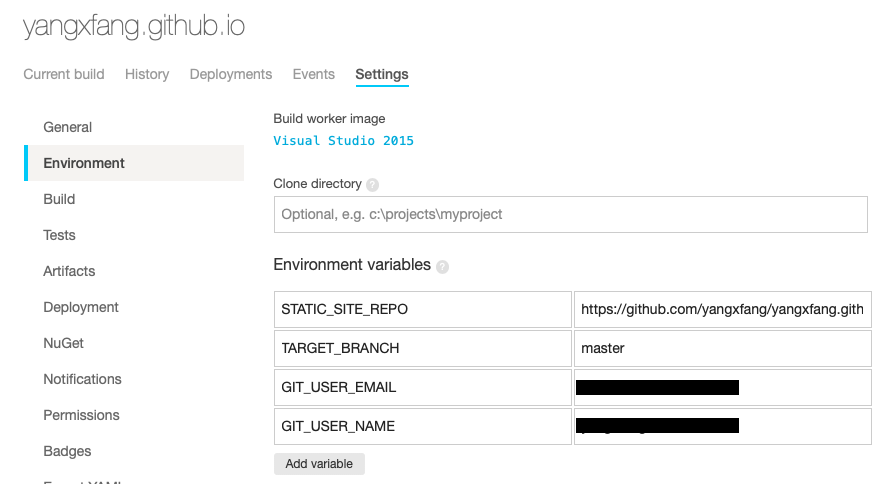

我在上篇博客[Hexo+Github建个人博客](https://yangxfang.cn/2019/01/05/hexo-github/)里写了如何搭建这个博客，在那之后我又做了些事，比如：对我的博客做了一些优化、同时发布到coding.net以便国内用户访问、绑定个人域名yangxfang.cn、推送网站给Google和百度搜索等。这些操作相对问题不多，网上有很多人写了详细步骤做参考。但是，在我弄持续集成时参考了很多人的文章和Github上的问题解决方案，还是折腾了很久才搞定，我决定把这个过程记录下来做参考。

## 环境构成和平台 ##

- HEXO    --- 博客的框架
- Next     --- 主题
- Github    --- 代码托管和Pages服务
- Appveyor    --- 持续集成平台

## 为什么持续集成 ##

因为源代码都在一台电脑上，意味着我编辑好博客内容后，要在这台电脑上敲`hexo g && hexo d`发布，换一台电脑就不行了。而且要是源代码在这台电脑上丢失或者损坏了，就只能重新部署和配置hexo和Next了，然鹅在经过长时间的优化、配置修改和插件安装后，我哪里还记得要装什么，要改什么。

所以，解决如上问题的方案是`持续集成`，英文叫做`Continuous Integration`。

## 解释下逻辑 ##

电脑1 ----->
                 |
电脑2 -----> --- Git Push to source code repo --- > Github < ---Build in Pages repo-- > Appveyor
                 |
电脑N ----->

- 所有电脑上的更新推送到Github的源代码分支 *(你可以自定义分支名称，我的叫Hexo)*
- Github库和Appveyor已经集成了，所以源代码分支一产生更新，Appveyor执行一次build
- Appveyor的Build任务将生成的静态网页内容推送到Github的Pages服务所用的分支 *(默认是master)*
- 完成！

直接用Hexo d的逻辑也就是：Hexo在本地生成好静态网页内容并推送到Github的Pages服务所用的分支。

理解了就可以开干了 :)

## 准备工作 ##

- 注册Appveyor，有免费滴！
- 本地和GitHub建立SSH信任：具体步骤在上一篇博客讲了；以后的其他电脑都需要做这一步骤

## 建立并推送源代码分支到Github ##

*源代码分支在后面叫做Hexo*

- 显示本地博客根目录的隐藏文件

  - 如有.git，删掉。

  - 编辑.gitignore，修改为如下内容；这个文件告诉Git哪些目录不需要推送

    >public/
    >.deploy*/

- 新建Git分支

  ```sh
   git init		#初始化Git
   git remote add origin git@https://github.com/xxxxxxxxxxxxxxx.git	#添加你的Git库
   git pull origin master		#把当前的master分支拉下来，避免后面冲突
   git branch hexo	#新建分支hexo放源代码
   git checkout hexo	#切换到hexo分支
   git add .	#将除了.gitignore以外的内容添加到hexo分支
   git commit -m "XXXX"	# -m就是message的意思，给这次commit备注一下
   git push origin hexo	# 将分支推送到Git库
  ```

- 新建Appveyor持续集成项目

  - 选择Github，settings里将Default branch和branches to build修改为hexo，即源代码分支

    

  - 进入Environment，添加如下环境变量，GIT_USER_EMAIL和GIT_USER_NAME就是你的git用户名与邮箱地址，用来连接Github；TARGET_BRANCH就是静态网页所在的分支。

    

  - 在Github的个人账号的`Setting > Developer settings > Personal access tokens`里新建一个Token。

    

  - 用Appveyor的[工具加密token](https://ci.appveyor.com/tools/encrypt)。

  - 在博客根目录下新建一个文件，命名 为appveyor.yml，内容如下，请参考备注决定你需不需要这些步骤。我在网上搜到的很多版本貌似都比较老旧了，不太适用于新版本。

    ```sh
    clone_depth: 6
    
    environment:
        access_token:
            secure: [这里放加密后的token，不需要[]]
    
    install:
        - ps: Install-Product node 10.0		#安装最新版node
        - node --version
        - npm --version
        - npm install npm@latest -g			#安装最新版npm
        - npm rebuild node-sass			#因build报错，我需要rebuildnode-sass，如果没有此报错则不需要
        - npm install hexo-cli -g		#安装hexo
        - npm install					#安装package.json里的所有依赖包
       
    build_script:
        - hexo generate			# hexo生成静态网页
        
    artifacts:
        - path: public		#静态网页放在public目录下
        
    on_success:			#下方脚本是为了推送静态网页到相对应的Github库和支线
        - git config --global credential.helper store
        - ps: Add-Content "$env:USERPROFILE\.git-credentials" "https://$($env:access_token):x-oauth-basic@github.com`n"
        - git config --global user.email "%GIT_USER_EMAIL%"
        - git config --global user.name "%GIT_USER_NAME%"
        - git clone --depth 5 -q --branch=%TARGET_BRANCH% %STATIC_SITE_REPO% %TEMP%\static-site
        - cd %TEMP%\static-site
        - del * /f /q
        - for /d %%p IN (*) do rmdir "%%p" /s /q
        - SETLOCAL EnableDelayedExpansion & robocopy "%APPVEYOR_BUILD_FOLDER%\public" "%TEMP%\static-site" /e & IF !ERRORLEVEL! EQU 1 (exit 0) ELSE (IF !ERRORLEVEL! EQU 3 (exit 0) ELSE (exit 1))
        - git add -A
        - git commit -m "Update Static Site"
        - git push origin %TARGET_BRANCH%
        - appveyor AddMessage "Static Site Updated"
    ```

- 使用持续集成：每次更新（包括修改了配置文件）只需执行以下步骤即可。

  ```sh
   git add .	#将除了.gitignore以外的内容添加到hexo分支
   git commit -m "XXXX"	# -m就是message的意思，给这次commit备注一下
   git push origin hexo	# 将分支推送到Git库
  ```

   Appveyor随机会自动执行appveyor.yml里定义的build步骤，打开控制台就可以看到完整的过程和结果。

## 修复Next主题无法推送的问题 ##

完成上一节的步骤后，居然发现网站一片空白…… 我查了半天，才发现原来是因为Next主题的所有文件都没有被推送到Hexo分支，网上提供的方案大致有：1、删除Next下的Git；2、使用subtree；3、使用submodule。方法2和方法3据说比较好，支持未来版本升级。但是我用了方法1，因为简单方便，希望版本升级的话请查询其他人的博客。

- 删除next目录下的隐藏文件夹.git

- 编辑next目录下的.gitignore，删除所有有关source/lib，因为大部分的第三方工具都会被跳过。

- 打开source/lib，这里放了你启用的所有第三方工具的文件。对于必须的工具，删除这些目录下的.git文件夹。不操作这一步的结果是，这些工具的文件不会被上传到Github，网页不会正确、全部显示该有的信息或者功能。

- 执行如下步骤：

  ```sh
  git rm -r --cached themes/next/		#去除分支里的缓存，同样针对必需的第三方工具，用相同的命令去除缓存，相应的目录就是themes/next/source/lib/XXXXX
  git add .	#将除了.gitignore以外的内容添加到hexo分支
  git commit -m "XXXX"	# -m就是message的意思，给这次commit备注一下
  git push origin hexo	# 将分支推送到Git库
  ```

- 这下是真的搞定了！不过上述步骤真的是简单暴力，请自行评估哦。