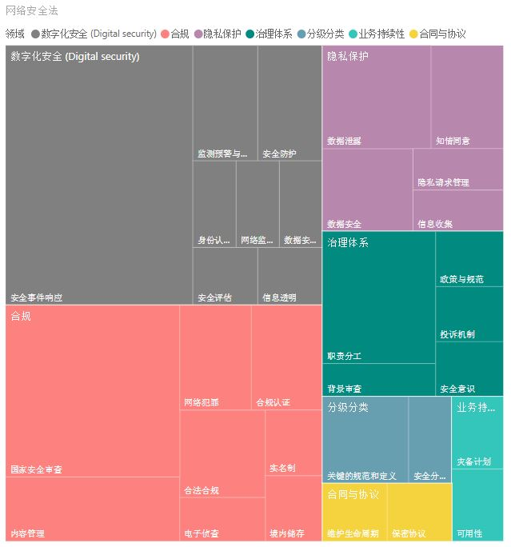
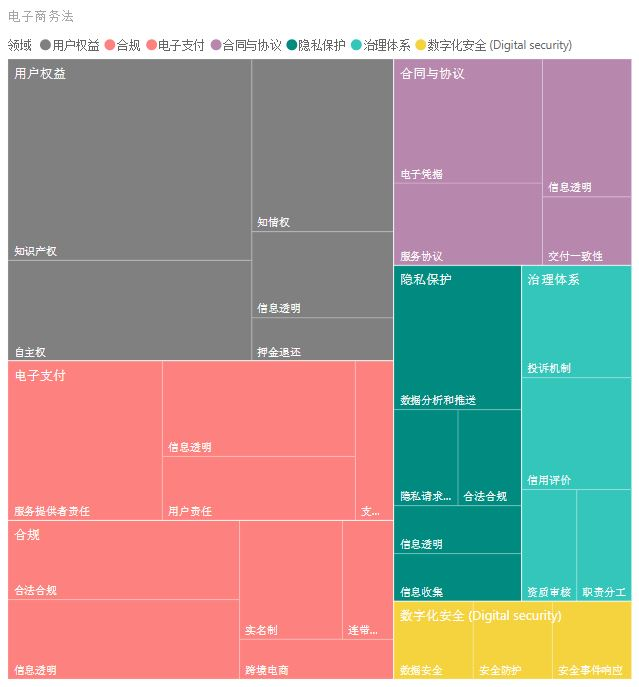
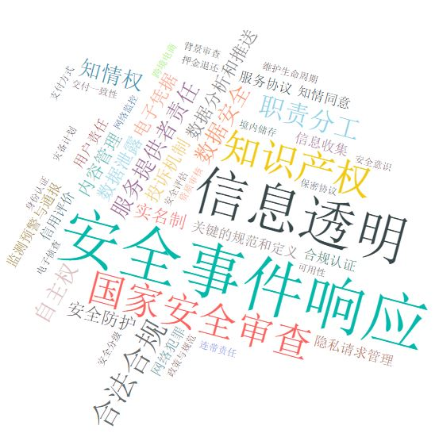
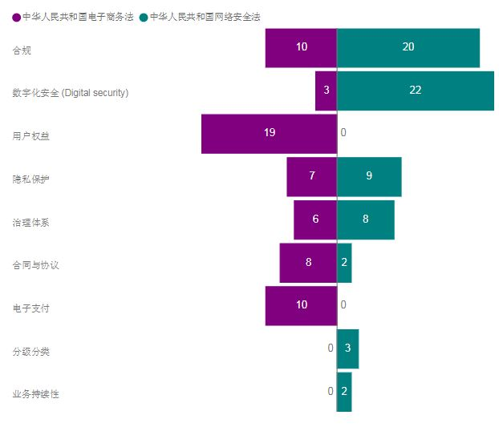
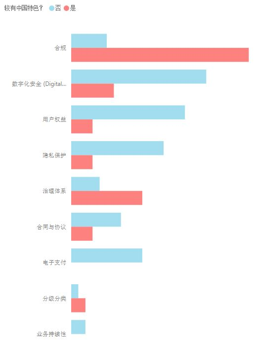
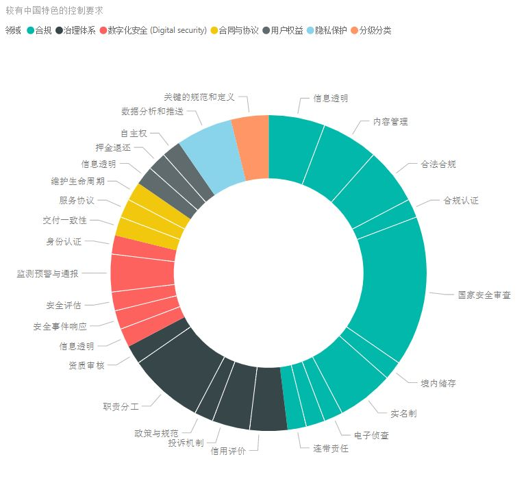
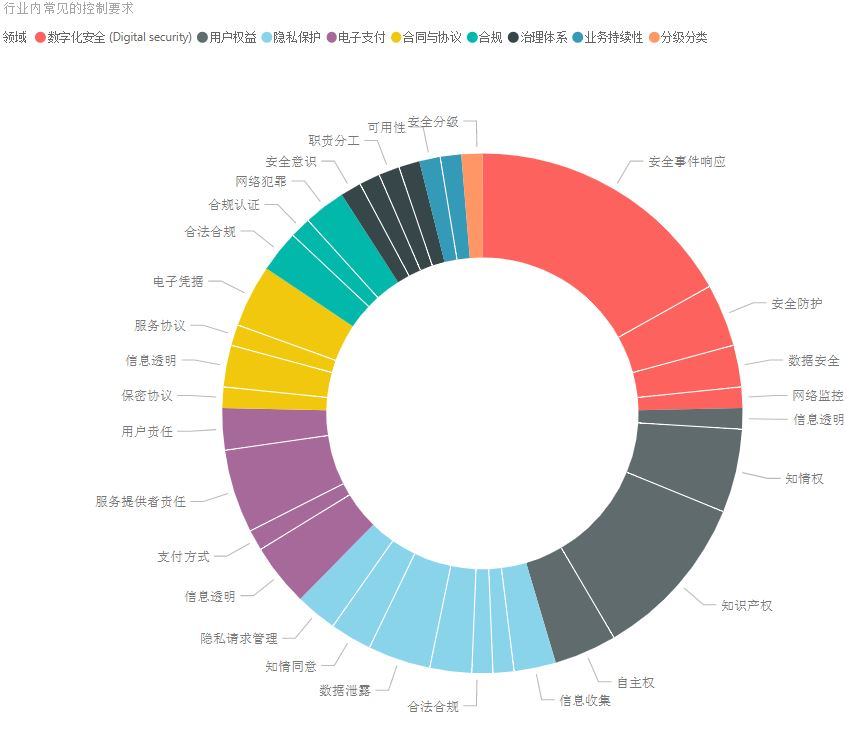
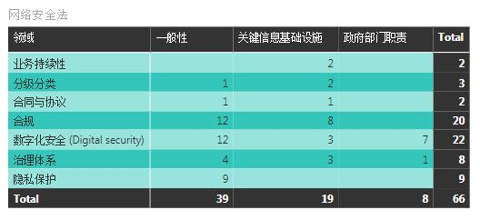
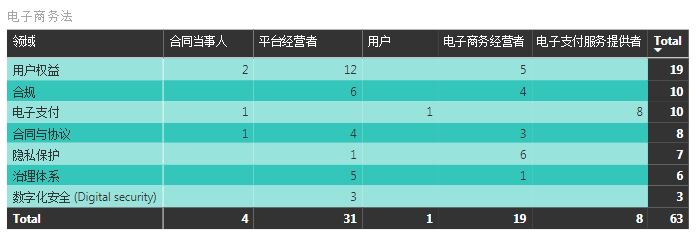

# 网络安全法和电子商务法里的IT控制要求 #

**说在前面**

本文章纯属作者从IT（信息技术）的视角对两个法律的解读，总结出来的内容用于个人学习和讨论的用途，任何单位和个人不得用于商业用途。文章内容的版权和解释权归作者所有。此外，作者不是法律专业人士，不保证解读内容的准确性和完整性，内容不得用于任何与法律有关的学习或者活动。如有任何单位和个人对内容有异议，应该及时向本站书面反馈，并提供身份证明、权属证明或详细情况证明，本站在收到上述文件后将会尽快更新或者移除相关内容。

*更多免责条款请参见本站的免责声明。*

------

**重要的说明**

1. 本文不再赘述有关网络安全法和电子商务法的背景、意义、生效日期、条款内容等基本信息，有兴趣的人请自行Google或者百度。
2. 为了便于比较和分析，我将与IT有关的条款分别打了标签，用于注明其所属的控制领域。如果有人感兴趣具体条款和标签如何对应的，请留言，我会再写一篇文章公布细节。
3. 在后续的分析中我会提到哪些控制要求比较有中国特色，哪些属于常见的行业标准。
   - 涉及网络安全的，由于行业标准和各国法规十分多，分类依靠本人长期的工作经验总结所得，就不罗列所有的标准了。如果哪位同学做出了条款和各大行业标准对照表的，请不吝分享。
   - 涉及电子商务的，我参考了英国的[The Electronic Commerce (EC Directive) Regulations 2002](http://www.legislation.gov.uk/uksi/2002/2013/contents/made)以及[Guide to Privacy and Electronic Communications Regulations](https://ico.org.uk/for-organisations/guide-to-pecr/)和[欧盟对电子商务网站的指引](https://ec.europa.eu/growth/sectors/tourism/business-portal/understanding-legislation/legal-regulations-e-commerce_it)。至于为什么只参考了这些呢，Google出来的前几项就是答案 :D 未来有空时，我会去研究研究其他国家或地区的要求的。
   - 涉及电子支付的，我参考了欧盟的[Payment services (PSD 2) - Directive (EU) 2015/2366](https://ec.europa.eu/info/law/payment-services-psd-2-directive-eu-2015-2366/law-details_en)。
   - 因为存在多个条款同属一个控制领域，某些条款比较有中国特色，某些比较行业内常见，所以当你看到我说某一个控制领域是有中国特色的，这不意味着整个控制领域都是中国独有的，请不要急于反驳，建议温和地留言并提出你的意见或者问题。谢谢支持。
4. 由于本人长期使用的工作语言是英语，有时候对专业术语的中文表述不是很准确，请见谅。;)

OK，把重要的免责声明和内容说明都讲清楚了，接下来我就直接开始正题了 :)

------

@[TOC]

## 1. 控制领域概况 ##

### 网络安全法 ###

首先网络安全法，我归类出7个大的领域 *（排名不分先后）*：

- 数字化安全（Digital Security）
- 合规
- 隐私保护
- 治理体系
- 分级分类
- 业务持续性
- 合同与协议

进一步归类并且统计每一类的要求数量，参见下图。可见，要求较为集中在数字化安全（Digital Security）和合规领域。其中，又以安全事故响应和国家安全审查的要求最多。`区别于其他安全规范，网络安全法里特别提及了隐私保护`。

作为一个法律文件，它不会提及具体的安全技术或者流程要求，这需要基于安全管理者的经验和认识进行实施。举个例子，第二十一条这么定义的：

> **第二十一条** 国家实行网络安全等级保护制度。网络运营者应当按照网络安全等级保护制度的要求，履行下列安全保护义务，保障网络免受干扰、破坏或者未经授权的访问，防止网络数据泄露或者被窃取、篡改：
> （一）制定内部安全管理制度和操作规程，确定网络安全负责人，落实网络安全保护责任；
> （二）采取防范计算机病毒和网络攻击、网络侵入等危害网络安全行为的技术措施；
> （三）采取监测、记录网络运行状态、网络安全事件的技术措施，并按照规定留存相关的网络日志不少于六个月；
> （四）采取数据分类、重要数据备份和加密等措施；
> （五）法律、行政法规规定的其他义务。

所以，到底要求仅仅是列举出来的这5条，还是更多？

偷懒的做法是只关注这5条并有很强的说辞来坚持这个看法；这种情况其实很常见，尤其当没有足够的预算时。

不过实事求是地看这条要求，重点其实是`保障网络免受干扰、破坏或者未经授权的访问，防止网络数据泄露或者被窃取、篡改`。虽然访问控制没有在5条里特别说明，我们不能否认这项控制对于达到如上目标的重要性。

### 电子商务法 ###

然后看电子商务法，我归类出7个大的领域 *(同样，排名不分先后)*：

- 用户权益
- 合规
- 电子支付
- 合同与协议
- 隐私保护
- 治理体系
- 数字化安全（Digital Security）

具体参见下图，可见，用户权益和电子支付被着重提及的领域。数字化安全（Digital Security）看似没有特别描述，但是不要忘记网络安全法哦，合规可不是合一个法律的规就行了。:)

**电子商务法的隐私保护和网络安全法的隐私保护有什么区别？**

| 隐私保护 子领域 | 电子商务法                           | 网络安全法                                 |
| -------------------- | ------------------------------------ | ------------------------------------------ |
| **信息收集**         | *无明显区别*                         | *无明显区别*                               |
| **信息透明**         | 服务提供者公示隐私请求管理流程的责任 | *无特别提及*                               |
| **合法合规**         | 提供信息给有关主管部门的要求         | *无特别提及*                               |
| **数据分析和推送**   | 使用数据分析推送广告的要求           | *无特别提及*                               |
| **数据安全**         | *无明显区别*                         | *无明显区别*                               |
| **数据泄露**         | *无特别提及*                         | 针对数据流露处理和响应的要求               |
| **知情同意**         | *无特别提及*                         | 收集和使用信息前获得用户同意的要求         |
| **隐私请求管理**     | 增加了用户注销的要求                 | 其他处理用户有关隐私的请求的要求无明显区别 |

**我把两个法律要求集中分析了以下，发现关键词出现最频繁的是......**

## 2. 网络安全法 vs 电子商务法 ##

简单地对比一下两个法律的侧重领域，见下图。显然用户权益和电子支付是电子商务法特有的，然而，*（我有点意外）*分级分类和业务持续性竟然在电子商务法没有特别提及。可能电子商务法还是更侧重在商务领域吧。

我的个人看法：即使不具体列举业务持续性的要求，像“数字化安全（Digital Security）”一样提及一下也是必要的。当电子商务对行业发展变得这么重要后，平台的高可用和容灾能力直接影响业务的可用性，这并不比数据安全的重要性低。

## 3. 较有中国特色 vs 行业内常见 ##

**这个章节也是为了抛砖引玉，我可能有理解不到位的地方，仅供大家参考。**

没有意外的是合规性要求比较多，例如实名制、资格审查、内容管理、境内储存关键数据、报送有关主管部门等等。

`需要特别指出的是，“较有中国特色”是个中性词，这不意味着要求是负面的或总是有关政府的，有些要求还蛮有创意，个人认为挺不错的`。举个例子，电子商务法的第三十九条：

> **第三十九条**　电子商务平台经营者应当建立健全信用评价制度，公示信用评价规则，为消费者提供对平台内销售的商品或者提供的服务进行评价的途径。
> 电子商务平台经营者不得删除消费者对其平台内销售的商品或者提供的服务的评价。

这条关于信用评价制度的要求自然是有益于服务提供者和消费者的。这在很多国内外的电子商务平台可能都有了，但是在法律里规范地写出来，无疑是进步的。同样的例子还有推送广告时要`向该消费者提供不针对其个人特征的选项，尊重和平等保护消费者合法权益`的要求。

还有几条十分细致的，对实际操作有影响的要求，这样细致的要求我还没在英国或者欧盟的法律文件里看到。*（如果我理解错了，这只是由于我的阅读量不够，请指正）* 例如：

> **第十九条**　电子商务经营者搭售商品或者服务，应当以显著方式提请消费者注意，不得将搭售商品或者服务作为默认同意的选项。
>
> **第二十一条**　电子商务经营者按照约定向消费者收取押金的，应当明示押金退还的方式、程序，不得对押金退还设置不合理条件。消费者申请退还押金，符合押金退还条件的，电子商务经营者应当及时退还。

具体看看到底涉及哪些较有中国特色的控制要求......

再附上行业内常见的控制要求作为参考......

## 4. 控制要求的适用范围 ##

最后，简单地看一下适用范围：

是不是发现要求少了很多，压力稍微减轻了点？:D 

再看电子商务法的，按角色对号入座后，要求其实也不是很多。

------

**欢迎讨论**