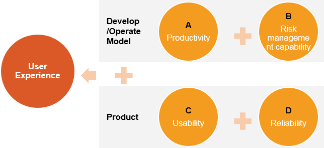
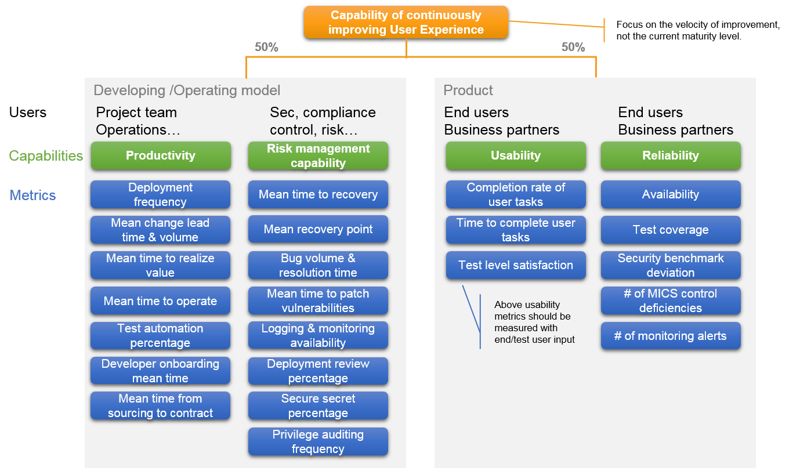

## Context ##

While DevOps model has been widely adopted by IT organization, I do not find a good framework to centrally measure the maturity of the model as well as the user experience as outcome.  So, I try to build one to provide a clear guidance, and I'd like to call it `DevOps benchmarking metrics and review framework`. 

This is not created from scratch, but is based on a lot of works and analysis done by different orgs.  The major source of reference is [DevSecOps guides from GSA](https://tech.gsa.gov/guides/dev_sec_ops_guide/). 

I hope this could be a good reading materials for peoples managing a DevOps team or working in security, compliance and risk areas. This is a high level review guideline, not a cookbook of DevOps or review. If you have any comments or questions, please leave a message below or contact me via email which can be found from my blog.

@[TOC]

## What do we want to achieve through DevOps? ##

First of all, we expect the team having a sustainable way to improve user experience continuously. **User means not only end user, but also other business stakeholders and IT support partners.**

To achieve that, the key capabilities should be defined **from both DevOps model and the product perspectives.** 

I draw a diagram to better explain the relationship between the aim and the key capabilities, as below. 

## What to look at for the capabilities we want to achieve? ##

Ok, now list down the main topics for assessing the capabilities identified above. I group them in 3 pillars: Governance, Process and Technology. The code of each capability (*A, B, C, D*) is put next to each topic to link them up.

| **Governance**                                               | **Process**                                                  | **Technology**                                               |
| ------------------------------------------------------------ | ------------------------------------------------------------ | ------------------------------------------------------------ |
| Team structure &   location `A` `C`                          | Demand shaping & biz value tracking    `A` `C`               | Automation capability *(both biz and IT processes)*    `A` `B` `D` |
| Role & responsibility &   people profile  *(both internal & external   resources)*   `A` `B` `C` `D` | User centric design * User interviews * Industry reviews * Product definition & roadmap * A/B testing   `A` `C` | Resilience of technologies * Risk level (from legal, security,   compliance standpoints) * Availability of the 3rd party services * Development/update lifecycle     `A` `B` `D` |
| Budget allocation &   procurement    `A` `B`                 | DevSecOps model * Agile planning (incl. Change   management) * CI & CD * Testing strategy & quality   assurance * Logging & monitoring * Application security * Risk management   `A` `B` `C` `D` |                                                              |
| Targeting setting    `A` `B`                                 | Business continuity * High availability * Disaster recovery     `B` `D` |                                                              |

## Which metrics can be used to measure these capabilities? ##

After all, it's always preferred by management team to have more visualized way to know the performance of the model or the product. Of course, it's also important to have some quantitative KPIs to know which areas still needs improvement. **However, please be noted that, when we decide to improve certain capability,  we should look back to relevant topics and good practices of those topics, but not focus on how to change the value of KPIs.** Why? the later way might lead to KPI manipulation and fake assessment. ;)

Below graph gives an overview of metrics under each capability, the detailed definitions can be found in "Reference" section. **It's suggested to focus on the velocity of maturity improvement, than current maturity level.** The reason is simple, as we expect the team to keep improving at a comfortable speed, but not be satisfied with what it is now.

## Reference ##

### Details of review topics ###

*This could be a good reference to perform a holistic review, I will not further elaborate what to review under each topic.*

#### Governance pillar ####

1. Team structure & location
2. Role & responsibility & people profile (both internal & external resources)
3. Budget allocation & procurement
4. Targeting setting

#### Process pillar ####

##### Demand shaping & biz value tracking #####

1. Business cases or KPIs definition, quantitative KPI calculation method
2. Business case tracking and validation
3. Collaboration with business and user story definition

##### User centric design #####

1. User interviews
2. Industry reviews
3. Product definition & roadmap
4. A/B testing

##### DevSecOps model #####

###### Agile planning (incl. Change management) ######

1. The flow of work: what are the steps it takes to get a Story to Done? what is the definition of done?
2. Tracking of the flow
3. Built-in quality: link technical standards to work items
4. Emergent design vs Intentional architecture: project specific design vs long-term strategy
5. Routines for planning: regular personal review and team review, backlog refinement, iteration review, iteration retrospective

###### CI & CD ######

1. Branching and merging policies
2. Tepository management
3. Dev/Test/Prod environment and pipeline setup
4. Ways of deployments
5. Build and release automation: including all mandatory test/scan/approval/technical requirements steps

###### Testing strategy & quality assurance ######

1. Testing strategy and mapping with CI/CD
2. Success criteria and target setting
3. Automation tools for all types of tests
4. Code scan: for quality, security including dependencies
5. Manual test and feedback
6. Bug tracking

###### Logging & monitoring ######

1. Logging requirements and enables
2. Consolidation of logs, alerts, reports
3. Monitoring tools
4. Tracking of security events, errors, performance issues

###### Application security ######

1. Security automation
2. Security hardening and monitoring at platform layer
3. Secrets (key/token/privileged credentials) protection
4. API and web services security configuration and monitoring
5. Vulnerability identification and patching process
6. Data loss prevention

###### Risk management ######

1. Pilot from risk perspective
2. Knowledge base and training
3. Dependencies on people and procurement processes
4. Architecture and security review 

##### Business continuity #####

1. High availability
2. Disaster recovery 

#### Technology Pillar ####

##### Automation capability (both biz and IT processes) #####

1. Automation platform
2. Continuity of automation platform
3. Control design in automation
4. Identity and access management
5. Development lifecycle
6. Logging and monitoring
7. License compliance

##### Resilience of technologies #####

1. Risk level (from legal, security, compliance standpoints) 
2. Availability of the 3rd party services 
3. Development/update lifecycle

### Details of benchmarking metrics ###

*The following weights of metrics and maturity values are defined based on my personal perspective from work experience, i.e. very subjective. Anyone who likes to adopt these metrics, should take the risk appetite of the organization into account and adjust them.*

#### Productivity ####

| **Metrics**                         | **Description**                                              | **Scope**           | **Weight in category** | **Low maturity value**   | **Medium maturity value** | **High maturity value**  |
| :---------------------------------- | ------------------------------------------------------------ | ------------------- | ---------------------- | ------------------------ | ------------------------- | :----------------------- |
| Deployment frequency                | Number of deployments to production                          | Past 6 months       | 5%                     | <=1 or >24               | <=6                       | <=24                     |
| Change volume                       | Average number of user stories deployed   in one sprint divided by working days of a sprint | Past 6 months       | 10%                    | < 0.2 or > 1             | >= 0.2 and <= 0.3         | > 0.3 and <= 1           |
| Mean change lead time               | Mean time between a code commit and   production deployment of that code | Past 6 months       | 15%                    | > 1 month                | >= 2 weeks                | < 2 weeks                |
| Mean Time to realize value          | Mean time between a feature request and   realization of business value from that feature | Last 3 releases     | 10%                    | > 1.5 years              | > 9 months                | <= 9 months              |
| Mean time to operate                | Mean time between the beginning of   Sprint 0 to achieving authority to operate | Last 3 releases     | 20%                    | > 1 month                | >= 2 weeks                | < 2 weeks                |
| Test automation percentage          | Percentage of test cases automated.                          | All active features | 15%                    | < 50%                    | < 80%                     | >= 80%                   |
| Developer onboarding mean time      | Time from a developer joining the team   to ability to commit code for production deployment | Past 1 year         | 15%                    | < 2 weeks or >= 2 months | >= 1 month and < 2 months | >= 2 weeks and < 1 month |
| Mean time from sourcing to contract | Mean time from the beginning of   sourcing process to contract sign-off | Past 1 year         | 10%                    | > 3 months               | > 1 month                 | <= 1 month               |

#### Risk management capability ####

| **Metrics**                      | **Description**                                              | **Scope**              | **Weight in category** | **Low maturity value** | **Medium maturity value** | **High maturity value** |
| -------------------------------- | ------------------------------------------------------------ | ---------------------- | ---------------------- | ---------------------- | ------------------------- | ----------------------- |
| Mean time to recovery            | Time between a failed production   deployment to full restoration of production operations | All active features    | 15%                    | > 1 day                | > 1 hour                  | <= 1 hour               |
| Mean recovery point              | Mean time range of data that is lost   due to an incident    | All active features    | 15%                    | > 1 day                | > 1 hour                  | <= 1 hour               |
| Bug volume                       | Average number of bugs reported after a   release            | Last 3 releases        | 5%                     | >= 50                  | > =10 and < 50            | < 10                    |
| Bug Resolution time              | Mean time to resolve a bug                                   | Past 6 months          | 10%                    | > 3 days               | > 1 day and < 3 days      | <= 1 day                |
| Mean time to patch vulnerability | Mean time between identification of a   vulnerability in the platform or application and successful production   deployment of a patch | Past 6 months          | 10%                    | > 3 weeks              | > 1 week                  | <= 1 week               |
| Logging availability             | Percentage of systems that are logging.                      | Platform & application | 10%                    | < 50%                  | < 80%                     | 100%                    |
| Monitoring availability          | Mean time from event generation to   being available to support team | Past 6 months          | 5%                     | > 1 hour               | > 10 mins                 | <= 10 mins              |
| Deployment review percentage     | Percentage of deployments being   reviewed from architecture or security | Past 1 year            | 10%                    | < 50%                  | < 80%                     | 100%                    |
| Secure secret percentage         | Percentage of app secrets are securely   created & accessed without any human interactions. | All active features    | 10%                    | < 50%                  | < 80%                     | 100%                    |
| Privilege auditing frequency     | Number of times that users and their   privileges are audited | Past 1 year            | 10%                    | <= 2                   | > 2 and <=12              | > 12                    |

#### Usability ####

| **Metrics**                      | **Description**                                              | **Scope**           | **Weight in category** | **Low maturity value** | **Medium maturity value** | **High maturity value** |
| -------------------------------- | ------------------------------------------------------------ | ------------------- | ---------------------- | ---------------------- | ------------------------- | ----------------------- |
| Completion rate of user tasks    | Percentage of user tasks completed   successfully versus total tasks | All active features | 35%                    | < 50%                  | < 80%                     | 100%                    |
| Mean time to complete user tasks | Mean time for users to complete tasks                        | All active features | 35%                    | >10 mins               | >1min and <= 10 mins      | <= 1 min                |
| Test level satisfaction          | Average level of overall impression of   user experience (on a 5-point scale) | Last 3 releases     | 30%                    | < 2                    | < 4                       | >= 4                    |

#### Reliability ####

| **Metrics**                   | **Description**                                              | **Scope**                        | **Weight in category** | **Low maturity value** | **Medium maturity value** | **High maturity value** |
| ----------------------------- | ------------------------------------------------------------ | -------------------------------- | ---------------------- | ---------------------- | ------------------------- | ----------------------- |
| Availability                  | Amount of uptime in accordance with the SLA                  | In a year                        | 25%                    | <= 99%                 | < 99.99%                  | >= 99.99%               |
| Test coverage                 | Percentage of code or feature that is   covered by unit, integration, functional and security tests | All active features              | 25%                    | < 50%                  | < 80%                     | 100%                    |
| Security benchmark deviation  | Deviation between security benchmarks   applied and the baseline | Platform & application           | 25%                    | > 50%                  | <= 50% and > 0%           | 0%                      |
| #of MICS control deficiencies | Number of key control deficiencies in   MICS assessment report | Latest report within the quarter | 10%                    | >= 3 or no report      | > 0 and < 3               | 0                       |
| #of monitoring alerts         | Amount of monitoring alerts triggered                        | Past 6 months                    | 15%                    | thousands              | hundreds                  | tens                    |