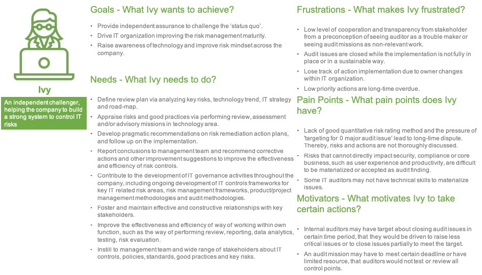

# How to respond to internal audit? #

After many years being participating in different audits and acting as an internal auditor, I believe writing this post would help clarify a lot questions people have about audit. More importantly, this is for IT guys to know how to respond an internal audit.

@[TOC]

## know about IT internal auditor ##

Before stepping into any practical tips, let's know something about IT internal auditor firstly. I built a persona for this group of peoples, and I call her `Ivy`. 

*I put words version to reference part to help reading.*

## How to respond to internal auditors ##

Assuming you have read through above persona, as it explains why I put following tips. 

### 1. Be honest and transparent ###

Internal auditors are exactly as same as you, as employees of the company aiming to add value and know how this company works. Sometimes, they move to internal auditor position from your function area, maybe used to be former you. 

If you try to hide something or are bluffing, you just let them doubt your credibility and let them question everything you say after (*even you may answer honestly to other questions*). When auditors find the real answer, you will make yourself silly. For sure, you can keep denying, but man, what is the value ? Take care of your reputation within the company.

### 2. Share known gaps and action plans ###

If you have already known some gaps and made action plans or projects to remediate, don't wait for auditors to find them out, share from the beginning. For known issues with proper action plans in place, they normally should not be seen as audit issues. 

But, please do not try playing clever on this point. For example, planning to fix a critical issue with a super long time period, fix partial issue, or making a fake plan, for sure you deserve audit issues.

### 3. Assume auditors know nothing about your area or expertise ###

Auditors cannot be experts in everything, that means they may not understand how the tool or protocol works, or why a process is designed as such. They would ask you step by step how it works, and may go back to previous questions many times. 

Conversation seems very simple and even boring. When you have been working in this area for many years, you may not notice some steps you take and don't see the risk. Auditors have good risk mindset, they try to break processes down to see where it may go wrong. To those potential risky points, they will try materializing them by analyzing history data and logs, and doing tests, etc. So, help auditors know all the details and they could help you to identify risks, it's win-win.

### 4. Define action plan together with auditors ###

If you think you must do what auditors ask for, I have to say this is a wrong perception. Auditors are good at risk, but they may not know as much as you do in your area or expertise. 

Auditors normally give you suggestions and seek for your feedback. Don't doubt about it, they really need your feedback, not just to be polite. Take some time to work together with them to define action plans making sense to both sides. Once an audit report is finalized and distributed to management, it will be very difficult to change the action plan or the target date.

### 5. Disagree with supporting evidences and risk explaination ###

As said previously, auditors are sharp and know how to identify risks, it does not mean their opinions are always right. When you strongly believe that the audit issue is not true, debate with supporting evidences and ideally prove the risk scenario described by auditors would not stand.

Just saying 'No, I don't think so' or speaking loud will not make your opinion strong or make anyone agree with you. It will only make you like a rude and cueless child. In simple word, try to be constructive.

**It's all for now, I'll come back to update when new tips come up. Good Luck !**

## Reference ##

### IT Internal Auditor Persona - Ivy ###

#### Values - What value Ivy brings to the company? ####

> An independent challenger, helping the company to build a strong system to control IT risks

#### Goals - What Ivy wants to achieve? ####

> - Provide independent assurance to challenge the ‘status quo’.
> - Drive IT organization improving the risk management maturity.
> - Raise awareness of technology and improve risk mindset across the company.

#### Needs - What Ivy needs to do? ####

> - Define review plan via analyzing key risks, technology trend, IT strategy and road-map.
> - Appraise risks and good practices via performing review, assessment and/or advisory missions in technology area.
> - Develop pragmatic recommendations on risk remediation action plans, and follow up on the implementation.
> - Report conclusions to management team and recommend corrective actions and other improvement suggestions to improve the effectiveness and efficiency of risk controls.
> - Contribute to the development of IT governance activities throughout the company, including ongoing development of IT controls frameworks for key IT related risk areas, risk management frameworks, product/project management methodologies and audit methodologies.
> - Foster and maintain effective and constructive relationships with key stakeholders.
> - Improve the effectiveness and efficiency of way of working within own function, such as the way of performing review, reporting, data analytics, testing, risk evaluation.
> - Instill to management team and wide range of stakeholders about IT controls, policies, standards, good practices and key risks.

#### Frustrations - What makes Ivy frustrated? ####

> - Low level of cooperation and transparency from stakeholder from a preconception of seeing auditor as a trouble maker or seeing audit missions as non-relevant work.
> - Audit issues are closed while the implementation is not fully in place or in a sustainable way.
> - Lose track of action implementation due to owner changes within IT organization.
> - Low priority actions are long-time overdue.

#### Pain Points - What pain points does Ivy have? ####

> - Lack of good quantitative risk rating method and the pressure of 'targeting for 0 major audit issue' lead to long-time dispute. Thereby, risks and actions are not thoroughly discussed.
> - Risks that cannot directly impact security, compliance or core business, such as user experience and productivity, are difficult to be materialized or accepted as audit finding.
> - Some IT auditors may not have technical skills to materialize issues.

#### Motivators - What motivates Ivy to take certain actions? ####

> - Internal auditors may have target about closing audit issues in certain time period, that they would be driven to raise less critical issues or to close issues partially to meet the target.
> - An audit mission may have to meet certain deadline or have limited resource, that auditors would not test or review all control points.

