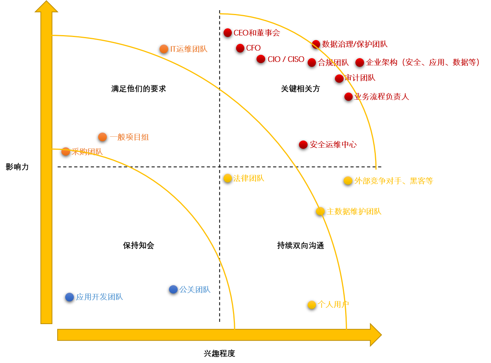
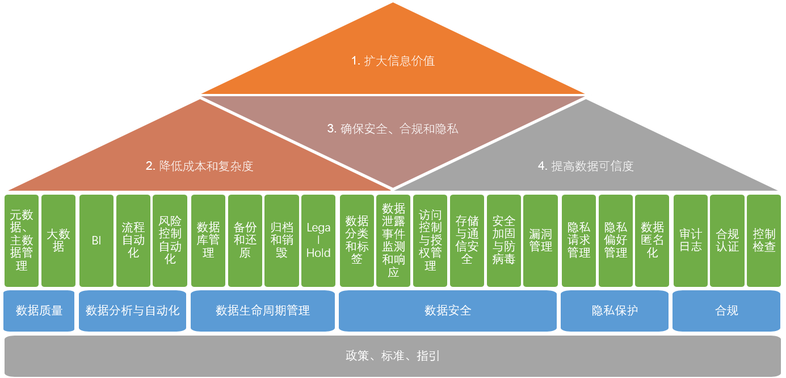

这篇文章是我的一些想法，没有拿来实际操作过，所以有些点可能不够专业或者不怎么具有实际操作性，欢迎任何意见或者建议。这些想法的的构建基于DGI的Data Governance Framework，该框架的所有信息都可以在网站http://www.datagovernance.com找到。

首先需要区别数据于IT，数据的价值即信息，信息的价值我就不赘述了。IT好比是一个城市的所有软硬件建设，而数据就是生活在这个城市的人们。人们能否快速有效地利用城市资源以实现自身价值，这显然是需要引导和管理的，数据亦然。无论是业务部门还是IT部门，肯定都经历过一些数据问题，比如主数据混乱、重复或错误数据、数据泄露等。数据的治理是一定需要业务和IT的协作，乃至不同业务部门间的协作才能实现，原因很简单，IT不是业务数据的所有者，数据是跨部门使用的。

## 哪些人是相关方？

在一个数据治理框架或项目里，如下团队或者个人应当属于相关方。影响力是指他们的决策或者行动对于数据治理的重要性，兴趣程度是指一般而言，他们对数据治理有关话题的关注程度。这里各个相关方的影响力和兴趣程度是我的个人判断，没有调研或者分析作为基础。

| 相关方                         | 影响力 | 兴趣程度 | 主要关注点                                 | 可带来哪些助益                                               | 可带来哪些风险                                         |
| ------------------------------ | ------ | -------- | ------------------------------------------ | ------------------------------------------------------------ | ------------------------------------------------------ |
| CEO和董事会                    | 高     | 中       | 重大事故影响公司股价和形象                 | 决策推动数据治理框架、项目的开展                             | 决策推延项目开展                                       |
| CFO                            | 高     | 中       | 财报真实、准确，SOX合规                    | 批准预算                                                     | 裁减预算                                               |
| CIO / CISO                     | 高     | 中       | 无重大事故或审计问题                       | 批准IT项目和费用以支持数据治理                               | 降低项目优先级                                         |
| 数据治理/保护团队              | 高     | 高       | 实现规划目标，无重大事故或审计问题         | 构建、管理数据治理有关流程，定义策略和规范；处置数据泄露事件 | 策略、路线定义错误；数据泄露事件处置不恰当带来负面影响 |
| 合规团队                       | 高     | 高       | 无重大合规问题，获得合规认证               | 执行合规检查；补充策略和规范                                 | 合规检查不完整、不全面、不能反映真实情况               |
| 法律团队                       | 中     | 中       | 获得必要信息支持诉讼                       | 补充策略和规范                                               | 法规要求指引不清晰                                     |
| 审计团队                       | 高     | 高       | 发现并汇报主要风险                         | 补充策略和规范                                               | 无                                                     |
| 公关团队                       | 低     | 中       | 无重大公众影响事件                         | 处置数据泄露事件                                             | 无                                                     |
| 采购团队                       | 中     | 低       | 降低采购成本，保持供应商的稳定性           | 方案、服务招标与采购                                         | 采购的要求和长耗时阻碍项目开展                         |
| 企业架构（安全、应用、数据等） | 高     | 高       | 规划IT架构以支持公司战略，规避风险         | 规划数据相关IT平台；补充策略和规范                           | 因无整体、长远规划而导致数据保护技术落后               |
| 安全运维中心                   | 中     | 高       | 及时监测并响应安全事故                     | 监测并响应数据泄露风险                                       | 无法有效、及时地监测数据泄露事件                       |
| 一般项目组                     | 中     | 低       | 按时按预算交付项目                         | 实施数据治理有关项目                                         | 项目无法实现预期的业务目标                             |
| 应用开发团队                   | 低     | 低       | 开发部署高效高质                           | 无                                                           | 漏洞、后门等安全问题引起数据泄露风险                   |
| IT运维团队                     | 高     | 中       | 无重大IT事故；高用户满意度                 | 维护、监控有关IT平台                                         | IT平台可用性低，性能差                                 |
| 主数据维护团队                 | 中     | 高       | 无主数据差错                               | 管理主数据                                                   | 主数据重复、错误、不完整                               |
| 业务流程负责人                 | 高     | 高       | 系统、数据可用、易用；数据分析支持业务运作 | 授权管理；补充策略和规范                                     | 无法定义、审核数据负责人、使用人等授权机制             |
| 个人用户                       | 低     | 高       | 个人信息是否被滥用、泄露                   | 无                                                           | 大量用户投诉、抱怨带来负面影响                         |
| 外部竞争对手、黑客等           | 中     | 高       | 利用系统或流程漏洞获得利益                 | 无                                                           | 窃取敏感、机密数据                                     |

所谓知己知彼才能百战不殆，分析相关方的一个重要目的是为了制定沟通策略。按照一般项目管理的相关方分析方法，可以绘制出下图。

## 要实现什么目标？目标如何衡量？

### 1. 扩大信息价值

- **信息即商品**：信息能够转化成可销售的产品（在合法合规的前提下）
  - 衡量指标：销售利润
- **支撑交易业务**：交易既可以是与客户或用户的交易，也可以是内部系统的transaction
  - 衡量指标：交易增长率
- **扩展市场渠道**：利用数据分析等手段增加用户量或进行精准定位
  - 衡量指标：新用户增长率、用户-交易转化率

### 2. 降低成本和复杂度

- **减少重复率**：包括master data和data records
  - 衡量指标：重复数据率
- **提高完整度**：意味着meta data管理也需要完善
  - 衡量指标：必要数据的完整度
- **简化授权管理**：数据治理的一个核心即要明确谁能在什么时候操作（CRUD：Create, Review, Update, Delete）什么数据，这里牵涉到如何进行授权。那么，在确保风险可控情况下简化授权过程对此目标至关重要。
  - 衡量指标：平均授权时长、风险控制不合规问题数量
- **提升系统整合效率**：IT底层和应用系统的更迭是很快的，数据一向是系统整合时的一大难题。
  - 衡量指标：数据清理和整合的时间与费用、新接口和存储的费用

### 3. 确保安全、合规和隐私

- **控制数据泄露风险**：所有重要、敏感、隐私数据。
  - 衡量指标：*TBD*
- **支持隐私请求**：例如定位、删除、导出当事人的个人数据，数据匿名化等。
  - 衡量指标：完成隐私请求的平均时长
- **实现合规目标**：取得合规认证，如SOX、ISO、PCI等。
  - 衡量指标：是否获得认证
- **降低（预）审计成本**：为了应付内外审计所做的预审计工作，或者内部审计。
  - 衡量指标：（预）审计期间所有涉及数据的操作所耗的时间和费用

### 4. 提高数据可信度

- **保障财务报表的准确度**
  - 衡量指标：*TBD*
- **支持基于数据的决策**
  - 衡量指标：*TBD*

## 如何实现目标？

### 流程和控制框架

为了支持以上四大目标，可以从六大方面出发来定义具体的政策、标准或者指引：

- 数据质量
- 数据分析与自动化
- 数据生命周期管理
- 数据安全
- 隐私保护
- 合规

其中很多流程都应当是已存在的，比如数据生命周期管理和数据安全里的大部分流程。但是，以IT服务为出发点设计这些流程和以数据为出发点来设计应当是不同的，比如，数据库管理、备份和归档在IT流程里完全可以分而治之。在理想的情况下，一份数据无论是进入‘生命’的哪个阶段（数据生命周期管理），无论是产生多少复本或者经历改动（数据质量），都应该是可追踪的、可回溯的（合规），并应用一贯的安全、访问（数据安全）或者隐私偏好设置（隐私保护）等策略，其产生的数据分析结果都应当是可信的，这一过程的控制缺陷能够被自动检测甚至修正（数据分析与自动化）。

因此，如何能把这一系列的控制串联起来是很有意思的事情。

*--未完待续--*