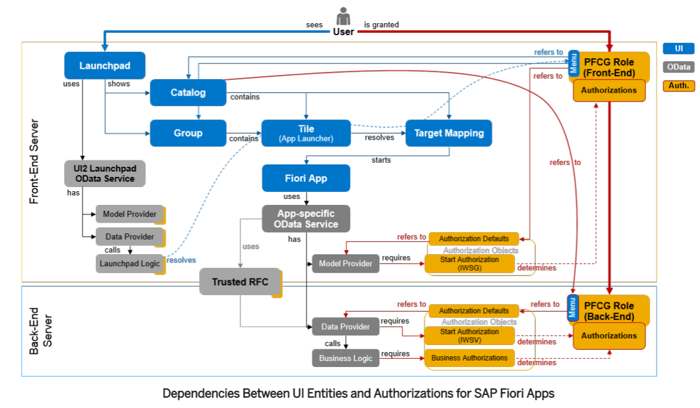
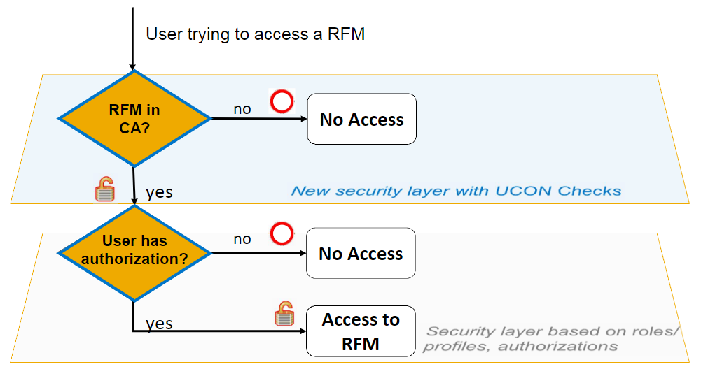
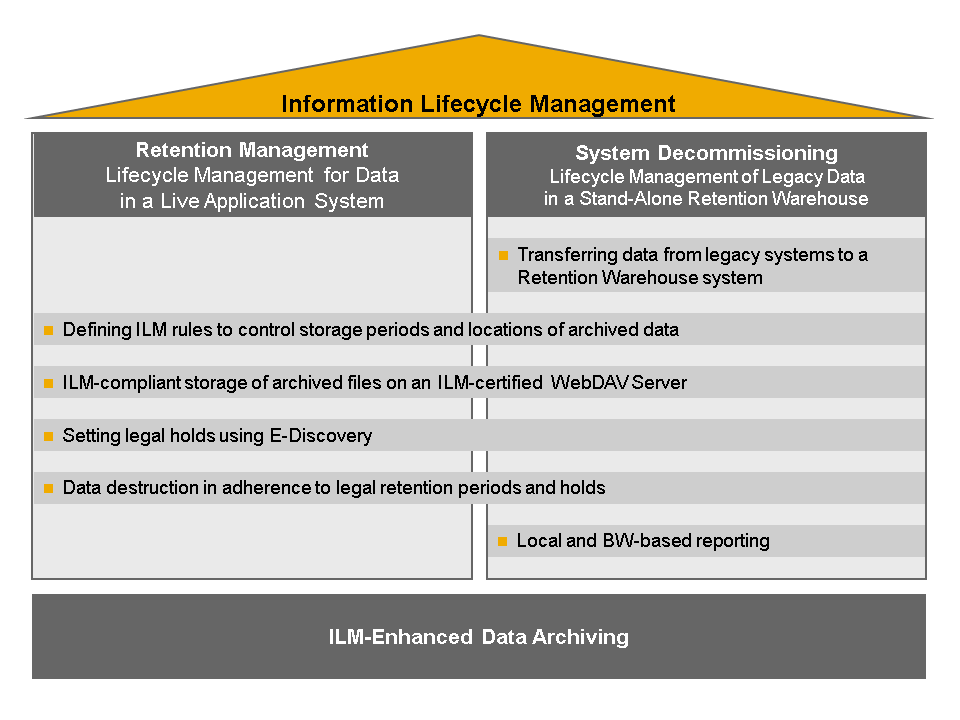
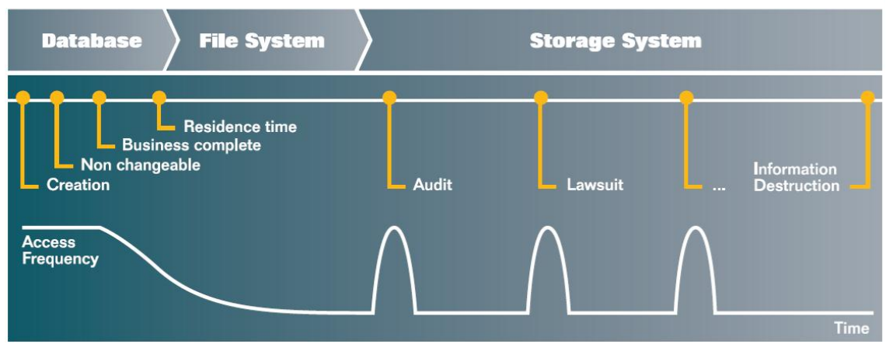

开启一个新的学习计划：`SAP S/4 Hana安全`！**这篇博客只是记录我的学习过程和心得，不会有什么系统化的解读或看法。所以，这里的心得不保证正确哦。**:)

这是个浩大的学习过程，我会不定时更新这篇博客。等我有所成了，再就具体的话题写点东西。 

---------------------------

**本次更新内容**

[Unified Connectivity (UCON) administration framework](#update-1)

[ILM: Information Lifecycle Management](#update-2)

--------------------

参考资料：

- SAP HANA Security Technical Whitepaper
- [SAP HANA Security Guide](https://help.sap.com/viewer/b3ee5778bc2e4a089d3299b82ec762a7/2.0.03/en-US)
- [SAP HANA Administration Guide](https://help.sap.com/viewer/6b94445c94ae495c83a19646e7c3fd56/2.0.03/en-US/330e5550b09d4f0f8b6cceb14a64cd22.html)
- [The XS Advanced Programming Model](https://help.sap.com/viewer/4505d0bdaf4948449b7f7379d24d0f0d/2.0.00/en-US/df19a03dc07e4ba19db4e0006c1da429.html)
- [Security Guide for SAP S/4HANA 1709 FPS01](https://www.sap.com/documents/2017/11/d42046ce-e27c-0010-82c7-eda71af511fa.html)                              *此文件超~~~~长，慎重跳进这个坑*
- [UI Technology Guide for SAP S/4HANA 1709 FPS01](https://help.sap.com/doc/61634ead9e5144b89e7eca2b1d4b8bce/1709%20001/en-US/UITECH_OP1709_FPS01.pdf)
- [SAP Information Lifecycle Management](https://help.sap.com/http.svc/rc/PRODUCTION/c3b6eda797634474b7a3aac5a48e84d5/1610%20002/en-US/frameset.htm?7fe188e04fdd462e8ec330bb80efc389.html)

**这个章节所有的图都来自于SAP官方**

## 认识SAP S/4 Hana的架构 ##

### 1. SAP Hana的架构 ###

- Hana数据库最大的特征就是`数据存储和处理都在内存`进行，这区别于所有其他数据库技术。这意味着，数据访问、查询和操作的速度都会大大加快，因为去掉了内存和其他存储间的I/O吞吐。
- 再看这个应用架构，所有类型的服务都模块化了：Application services和Integration & Quality Services属于支持型的服务；Processing Services是对用户可见的服务；安全（包括高可用、灾备）等设计是基于数据层的，这很有意思。

### 2. SAP S/4 Hana的架构 ##

- 仍然是三层架构， SAP S/4是应用层，Hana是数据库层

- BW或者其他SAP应用同理

  

### 3. SAP Hana安全服务构成 ###

- 基本上就是AAA: Authentication, Authorization, Accountability + Data Security: Anonymization, Masking, Encryption
- 这里的数据安全三大块服务可以很好地支持隐私数据保护

## SAP介绍的安全服务 ##

1. 数据和日志分别备份到”硬盘 Disk"的不同卷

   *[手工检查备份是否有效、数据能否恢复的方法](https://help.sap.com/viewer/6b94445c94ae495c83a19646e7c3fd56/2.0.03/en-US/77522ef1e3cb4d799bab33e0aeb9c93b.html)，有名：审计的好朋友 :)*

2. Primary和Secondary系统的高可用模式是Active-Active，实现存储和系统级别的复制

   a. 除了上面#1和#2，以下高可用服务是可用的，但需要配置：service auto-restart, host auto-failover

3. 自定义数据分析报表可以将数据源导入Hana（即第三方数据源与Hana建立连接），然后在Hana定义针对此项目的数据访问权限，权限分配给用户

4. 基于SAP Hana的应用开发模型是XS Advanced，支持语言： Java, node.js, SQLScript。基于此模型开发出来的应用可以直接对口Hana数据服务；这意味着，不一定要运行在SAP S/4之上

   a. XS Advanced应用用户验证可以使用基于SAML2的验证服务或者SAP Hana自身的身份验证服务

   b. 用户权限控制可以到数据行（row-level）级别

   c. 用户权限在XS Advanced应用层级完成，不需要SAP Hana的角色role

   c. 源代码管理可以使用Git

   d. SAP将不支持传统开发模式 XS Classic

5. 用户管理：使用SAP Hana管理工具：SAP HANA cockpit

   a. 可以集成LDAP、SAP Identity Management和SAP Access Control；其他类型集成采用Hana SQL接口。再看看单点登录在三种连接情况下的支持性：

   | Single sign-on method | SAP HANA JDBC/ODBC | XS Classic HTTP(S) | XS Advanced HTTP(S) |
   | --------------------- | ------------------ | ------------------ | ------------------- |
   | Kerberos/SPNego       | yes                | yes                | planned             |
   | SAML                  | yes                | yes                | yes                 |
   | SAP Logon Tickets     | yes                | yes                | no                  |
   | SAP Assertion Tickets | yes                | yes                | no                  |
   | JWT                   | yes                | no                 | yes                 |
   | X.509                 | no                 | yes                | planned             |

   b. 用户组User Group用与安全策略，如SOD，不是用于数据访问权限管理

   c. 角色Role里定义一堆权限，然后分配给用户；也可以用LDAP的安全组管理角色分配

   d. 两类权限：SQL (Object)和Analytics；SQL(Object)就是管理对SQL对象的访问权限，Analytics则是数据级别的权限，可以细致到数据行；DB admin默认没有访问数据的权限，需要额外授权

   

   e. 最终用户通过应用层访问数据，需要应用ABAP或者XS Advanced为此用户在SAP Hana新建Analytics权限，权限检查依然可以在应用层完成

6. 支持Dynamic data masking，即不mask原始数据，当没有UNMASKED权限的用户读取数据时，数据会被mask

7. 数据匿名Anonymization同样支持在查询数据时才匿名化

   a. 可以将特定字段泛化处理

   b. 有专门给data privacy officer可见的视图

   c. 可以控制用户访问匿名化数据的权限，也有相关的审计记录

8. 数据加密

   a. 备份数据和日志都可以加密

   b. 生产数据，即内存里的数据可以针对某个字段column加密 （当然存在“硬盘”disk上也会被加密）

   

   

   c. 应用加密调用SAP Hana的encryption API

   d. 秘钥存储在SAP的SSFS文件系统，管理秘钥可用工具cockpit；但是字段column级别的加密秘钥需要在SAP Hana和客户端（应用）进行配置。

   e. 传输层加密支持TLS/SSL，这包括SAP Hana内部的数据传输

9. 审计日志支持syslog

10. SAP Hana默认部署为多租客模式Multi-tenancy；系统管理则可以集中进行。所以，检查权限时需要同时检查Tenant DB和System DB。

    

11. cockpit提供安全配置、维护和管理功能，并提供如下方面的检查清单（和报告？）

    

12. 存在可用的第三方安全工具和SAP Hana的接口

    

### SAP HANA Security Guide的内容 ###

一般性指引其实就是说打补丁，checklist的话分了两大块：SAP Hana Database和XS Advanced Model，即数据库与应用开发的安全指引。简要列举如下：

**1. SAP Hana Database:**

- Users, Roles, Privileges

  - 系统超级管理员SYSTEM和_SYS_REPO，只有这俩有DATA ADMIN（执行所有DDL），DEVELOPMENT（执行alter system）权限；_
  - SYS_BI_CP_ALL权限有读所有数据权限，默认只有角色CONTENT ADMIN和MODELING有此权限，默认只有SYSTEM有此角色；
  - 默认没有用户有DEBUG权限，不可以将生产环境的DEBUG或ATTACH DEBUGGER指派给任何用户；
  - 角色 CONTENT_ADMIN应只分配给需要更新系统的DB用户；
  - 角色MODELING不应分配给任何用户，应作为模板的存在；
  - 角色SAP_INTERNAL_HANA_SUPPORT有所有底层的系统特权；
  - 不可给用户管理所有Repository的权限，可以分别授权；
  - _SYS_*密码永不过期；
  - 应只有USER ADMIN权限的用户可以修改CLIENT属性；
  - 完整的[标准用户清单](https://help.sap.com/viewer/b3ee5778bc2e4a089d3299b82ec762a7/2.0.03/en-US/de4ee8bbbb5710148a04f023da147c8d.html)

- Network Configuration

  - 没啥特别的建议，无非就是网络隔离之类的......网络连接图参考一下：

    

    分布式下网络连接图：

    

- Data Encryption

  - 之前讲到秘钥保存在文件系统SSFS，所以就又有个master key，这个在安装时要设置，所以安全地保存此key很重要；同理还有PKI的master key；
  - 所有数据或者日志备份都会有个根加密秘钥root encryption key；
  - SAP Hana client的连接信息（包括密码）保存在hdbuserstore；
  - 默认数据和日志加密是`没有`启用的。

- File system and Operating system

  - OS用户有这些：sapadm (required to authenticate to SAP Host Agent)、<sid>adm (required by the SAP HANA database)、Dedicated OS users for every tenant database if the system is configured for high isolation；
  - 文件的访问权限配置在indexserver.ini，默认权限是640 ([import_export] file_security=medium)；
  - OS安全补丁默认`没有`安装。

- Auditing

  - 审计功能默认`没有`启用。

- Trace and Dump files

  - 没啥特别的，主要是协助运维人员排错的功能。

- Tenant database management

  - 所有tenant数据库使用同一个库用于身份验证，所以各个数据库应有自己的证书建立与验证系统的连接，避免一个数据库的用户可以访问其他数据库；
  - 配置黑名单文件multidb.ini，这里定义了哪些配置只能由系统管理员修改；
  - 可以禁用个别数据库功能以限制访问或使用。

**2. XS Advanced Model:**

- Administration user
  - 超级管理员用户类型XSA_ADMIN，这应该只用于初始安装和配置，不可用于日常运维；
  - 完整的[标准用户清单](https://help.sap.com/viewer/b3ee5778bc2e4a089d3299b82ec762a7/2.0.03/en-US/04ede29ac92841c58c1749b070a66c4b.html)
- Organizations and spaces
  - Space是用来做应用隔离的， 一个Space的应用使用一个OS用户；
  - 不要用<sid>adm或任何特权账号来运行应用；
  - SAP系统应用在SAP Space里；
  - 使用个人账号登录XS CLI，就是说不要用系统或者应用账号。
- Network Configuration
  - Platform Router类似于应用网关，接受来自外部的请求，需要合理配置一下；
  - JDBC到SAP Hana的连接默认`不`加密，需要额外配置一下；
  - 默认下，XS Advanced服务器使用自签名证书。

### SAP S/4 Hana Security Guide的内容

这里简要列举通用服务的安全，不涉及业务应用。

**1. 用户管理**

用户类型、角色和标准用户与此前的SAP版本没有显著差别。S/4有一个新的UI/UX技术，叫做Fiori。基于Fiori的app所带来的用户角色、权限管理会有所不同，具体逻辑见下图：

- 使用PFCG管理用户角色；
- Fiori UI定义哪些app可以被用户访问；
- App的OData service读取有关业务数据；
- Authentications模块验证用户是否有权限使用这些OData services。

关于新的UI下的用户和App管理，SAP有一系列建议，具体的可以参考[UI Technology Guide for SAP S/4HANA 1709 FPS01](https://help.sap.com/doc/61634ead9e5144b89e7eca2b1d4b8bce/1709%20001/en-US/UITECH_OP1709_FPS01.pdf)。大体上就是最小化权限的原则，使用安全协议的连接等。

**2. 网络和通讯安全**

支持如下协议：

- HTTP + TLS/SSL
- RFC + SNC
- SOAP + Web services security
- IDoc
- REST

这里着重提到了SAP ICF，Internet Communication Framework，具体的可以参考[这个介绍](https://help.sap.com/doc/abapdocu_751_index_htm/7.51/en-US/abenicf.htm)。简单地说就是一系列安全的API接口，用于ABAP应用与互联网信息传输。既然是面向互联网，很多安全风险需要防范，例如病毒、XSS等，这个可以未来好好研究一下。

**3. 病毒扫描**

- 可以对上传和下载文件及模板进行病毒扫描；
- 白名单需要维护，设置定义在自定义文件ZBASIC和ZEXTENDED；

**4. Web安全**

针对active content，此间技术是 SAP WebDispatcher和 Internet Communication Manager (ICM)，可以修改HTTP header。SAP的建议是增加以下内容到header：

> - SetResponseHeader X-Content-Type-Options "nosniff"
> *This tells the browser not to try reading the attached file with the assumed MIME type.*
> - SetResponseHeader X-XSS-Protection "1; mode=block"
> * This prevents cross-site scripting.*

针对点击劫持（Click-Jacking），是用一种白名单的技术，就是说定义哪些主机和端口下的哪些页面、组件能在应用里显示。据说Fiori的方案还不一样，更安全什么的，具体待研究。

**5. Unified Connectivity (UCON) administration framework**

- 这是一个RFC连接安全的解决方案，简单地来说就是找出需要用户交互的RFM， 拦截来自外部对所有其他RFM的访问。

  - 据统计，只有很少的RFM是需要用户交互的（大约1%？），其他均是系统调用。

- 原理是多加了一层安全验证，如下图：

  

- SAP有一个应用此方案的指引，可参考[Unified Connectivity (UCON) Overview](https://www.sap.com/documents/2015/07/ccf7ed8e-5b7c-0010-82c7-eda71af511fa.html)

**6. Securing CALL TRANSACTION Statements**

在用户调用T-code时检查其权限，系统调用则不用。对于新建的SAP S4/HANA环境，SAP建议值` auth/check/calltransaction=3`。

**7. Read Access Logging**

特别针对个人数据启动读数据的日志记录。

**8. ILM: Information Lifecycle Management**

基本框架如下，就是data retention + system decommissioning。列举了几个常见的使用场景：

- Legal holds：因法务要求控制数据		*不晓得正确的中文翻译是啥-_-|||*
- 财务、税务审计
- Data retention
- 销毁数据

指引里有一些关于ILM本身数据安全的说明，还可以参考[SAP ILM Detailed Presentation](https://archive.sap.com/kmuuid2/80e210b6-b1b9-2e10-0cb5-ff8e36743d3f/SAP%20ILM%20Detailed%20Presentation.pdf)。据SAP文档的描述，该系统也可用于管理非SAP系统的数据。

​	SAP有张不错的图来描述data lifecycle：

​	

​	

**9. 支付卡数据安全**

*这又是个大坑，下次有空专门写一期这个吧.....*

--- 未完待续 ---