## 注册一个Github账号，新建一个repository ##

- 命名方式`<Github用户名>.github.io`，比如我的库叫做yangxfang.github.io。操作完毕后将这个名字输入浏览器地址栏就可以访问个人博客网站啦。
- 至于repository的设置，这是个Public库 :)

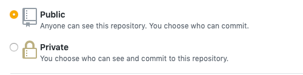

​	在Settings里找到Github Pages，这里可以选择一个主题。这里就可以知道在Github里搭建个人博客依赖的技术就是Github Pages啦。

​	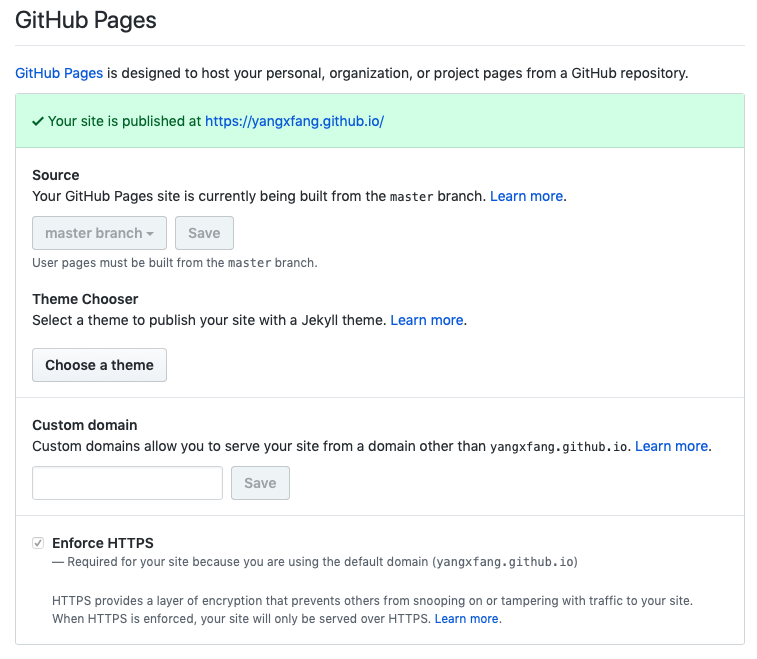

## 本地安装Hexo，发布到Github ##

- 安装依赖组件：`Git`、`Node.js`；Windows、Mac或Linux版本均有。

  Mac上的命令如下

  ```sh
  sudo brew install git
  sudo brew install nodejs
  sudo brew install npm
  ```

  Node.js的安装也可以是：

  ```sh
  curl https://raw.github.com/creationix/nvm/master/install.sh | sh
  ```

- 安装Hexo

  ```sh
  npm install -g hexo-cli
  ```

  cd 你的个人博客源文件目录，也可以不用特别指定目录

  ```sh
  hexo init myblog	#自定义名字
  cd myblog	#进入这个myblog目录
  npm install	#配置node
  hexo g && hexo s		#这会创建基础网页，启动Hexo服务，根据提示拷贝http://localhost:4000/进入浏览器查看，按ctrl+C停止服务
  ```

- 安装网站主题，Hexo网站上有非常多主题可选，我选了NexT（*详细介绍见https://theme-next.org*）

  ```sh
  git clone https://github.com/theme-next/hexo-theme-next themes/next		#安装完成后可以在Themes目录下看到next目录
  ```

- 配置hexo，编辑`_config.yml`

  ```sh
  vi _config.yml	#我用VIM编辑，当然你也可以用其他工具编辑
  ```

  网站基本信息：

  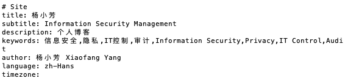

  网站主题配置为next，部署方式为git，部署地址为github库的完整url，所属的库branch为master

  *当然你可以部署到其他branch，那就要去库的设置里把Pages的branch修改一下*

  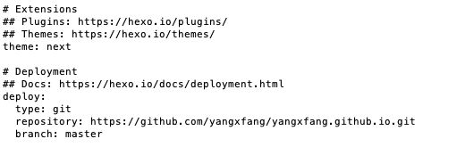

- 配置主题，编辑`themes/next/目录下的_config.yml`

  NexT的扩展性很好，有很多插件可以启用，它的中英文网站有具体的说明，下方稍微列举下我配置的。

  - 网页上可见的目录，默认只有home、archives，如需要就去掉#。

    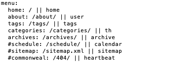

  - 主题设置，默认Muse，我的是Gemini

    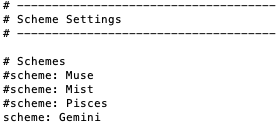

  - 启用回到顶部b2t，显示下滑条百分比scrollpercent    *注意此选项仅对Pisces和Gemini主题有效*

    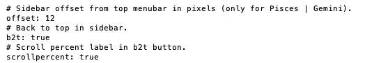

  - 评论功能 :D，这里我使用了Valine

    要用这个功能需要注册Leancloud（*免费版即可*），新建一个myblog的应用，在应用配置里找到appid和appkey，填在下方

    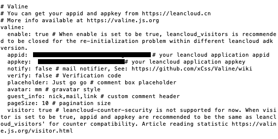

  - 同时还可以利用Leancloud来统计每篇文章的访客数量，可以使用相同的appid和appkey

    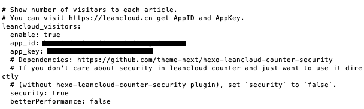

    还没完，在hexo的主_config.yml也需要配置

    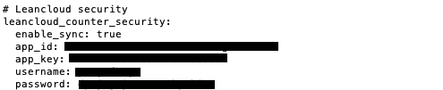

    安装有关组件并注册：

    ```sh
    npm install hexo-leancloud-counter-security --save
    hexo lc-counter r 用户名 密码
    ```

  - 启用分享到其他社交网站的功能

    **`注意`** 很多功能是需要安装依赖包的，具体都会描述在Dependencies里，这就需要回到Hexo myblog目录来安装这些包，例如：

    ```sh
    git clone https://github.com/theme-next/theme-next-needmoreshare2 source/lib/needsharebutton
    ```

    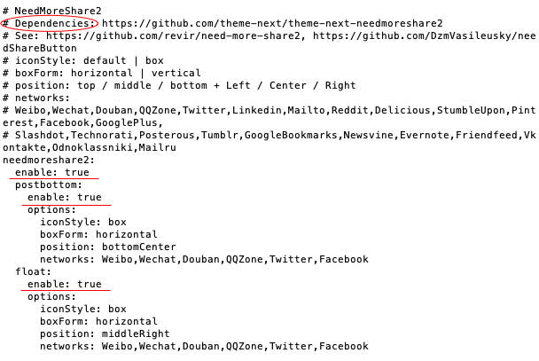

  - 搜索功能

    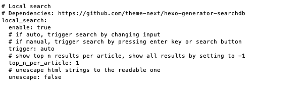

  - 主页不显示全文，仅预览

    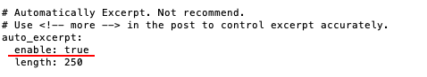

  - 配置文件那么长，自己多多发掘好用的功能吧 :)

- 终于要发布到Github了，让Github和本机相互信任一下 :)

  - 生成SSH

    ```sh
    git config --global user.name "yourname"	#用的是Github的用户名
    git config --global user.email "youremail"	#用的是注册Github的邮箱地址
    ssh-keygen -t rsa -C "youremail"
    ```

  - 在执行目录下找到公钥`pub`和私钥

    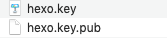

  - 回到Github的个人设置页面，创建一个新的SSH and GPG keys，将公钥内容完整复制到key里，完成后就长这样吧

    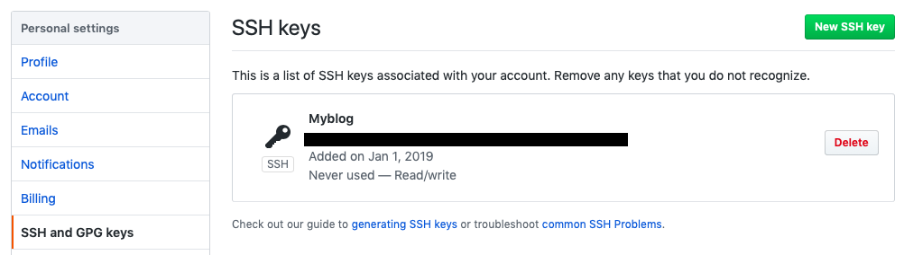

  - 部署Hexo

    ```sh
    npm install hexo-deployer-git --save	#安装组件
    hexo clean && hexo g && hexo d
    ```

  - 部署完毕后，就可以在Github的库里看到所有的文件，打开网址yangxfang.github.io 就👌啦

## 写博客 ##

- 新建博客

  ```sh
  hexo new post "标题"
  ```

  新的md文件就会出现在`source/_posts/`目录下

- 编辑内容

  md文件需要用`Markdown编辑工具`，我用的是Typora

  - 在文章内插入图片，这真是折腾了我好一会。在`_config.yml`里找到配置`post_asset_folder: `改成`true`。修改之后，新建一个post时，hexo会自动建立一个同名的文件夹，在编辑md时把图片放在这个目录下即可。

  - 在文章内插入目录， 首先安装组件

    ```sh
    npm i hexo-renderer-markdown-it --save
    npm i hexo-renderer-markdown-it-plus --save
    ```

    在`_config.yml`里添加如下内容

    ```
    markdown_it_plus:
      highlight: true
      html: true
      xhtmlOut: true
      breaks: true
      langPrefix:
      linkify: true
      typographer:
      quotes:
      pre_class: highlight
    ```
    

     在文章内需要插入目录的位置输入`@[TOC]`

- 发布

  ```sh
  hexo g && hexo d
  ```

## 如果觉得github.io网址不够酷 ##

那就自己买个域名，解析为Github的IP，在GitHub里设置自定义的域名，source目录下创建cname文件（无后缀），写进自定义的域名，最后，再发布一次Hexo到Github

```sh
hexo clean && hexo g && hexo d
```


**博客最最最重要的当然就是内容，我要不断学习Markdown编辑方式，把自己的学习和心得体会都记录下来 ^  ^ **

