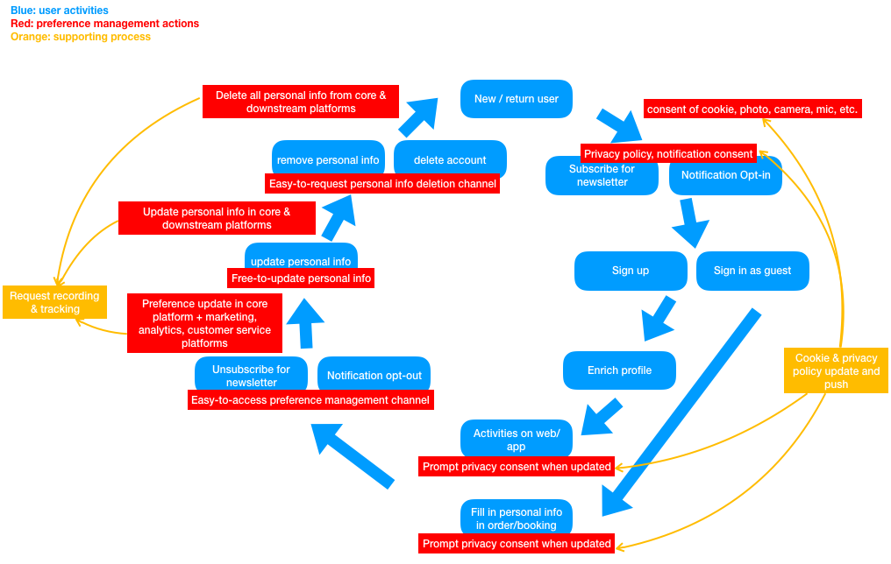

In a typical user-facing web/mobile app, privacy related user activities can be described as below blue cycle.

Next, the privacy preference management requirements can be defined based on this cycle in red. Most requirements should be realized in automatic way. 

To ensure sustainability, supporting processes in orange should be setup. 

Most preference management actions are straight forward and should be easy to understand. In terms of what kind of preference to manage, I made a "Who-Do-What" mapping as following graph. If a preference management panel provides capabilities to users to control these items, most scenario's should be covered properly.

Big world-wide social networking and Internet platforms, e.g. Facebook, Twitter and Google could be used as reference. 

**Facebook:**

- High-level categories:

- Details of Privacy

- Details of Timeline and Tagging
  
- Location is an on/off setting.

**Twitter**

**Google**

1. Personalize your Google experience

   - Web & App Activity
   - Location History
   - Device Information
   - Voice & Audio Activity
   - YouTube Search History
   - YouTube Watch History

2. Help people connect with you

   - Help people who have your number connect with you across Google services. Learn more
   - Also help them find your name, photo, and other information that you've made visible on Google. Learn more

3. Control what others see about you

   - Shared endorsements

4. Make ads more relevant to you

   You can change the types of ads you see from Google when you adjust your interests, age and gender or opt-out of ads based on your interests. Please note that you will still see ads after opting out — they’ll just be less relevant.